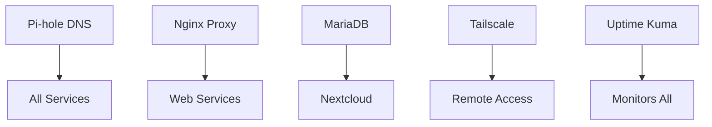

# 🚀 Service Registry

Complete registry of all deployed services with access information and configurations.

Last Updated: 2025-11-24  
Status: ✅ Verified via system audit

## 📊 Service Overview

| CT | Service | Version | IP | Port | URL | CPU | RAM | Disk | Auto-Start | Status |
|----|---------|---------|-----|------|-----|-----|-----|------|------------|--------|
| 100 | Tailscale | Latest | 192.168.40.10 | 22 | - | 2 | 512MB | 8GB | ✅ | ✅ Running |
| 101 | Pi-hole | v6 | 192.168.40.53 | 53,80 | [pihole.homelab.local](http://pihole.homelab.local) | 2 | 512MB | 8GB | ✅ | ✅ Running |
| 102 | Nginx Proxy Manager | Latest | 192.168.40.22 | 80,81,443 | [nginx.homelab.local](http://nginx.homelab.local) | 2 | 2GB | 8GB | ✅ | ✅ Running |
| 103 | Uptime Kuma | 1.x | 192.168.40.23 | 3001 | [status.homelab.local](http://status.homelab.local) | 1 | 512MB | 8GB | ✅ | ✅ Running |
| 104 | Nextcloud | 32.0.1 | 192.168.40.31 | 80 | [cloud.homelab.local](http://cloud.homelab.local) | 2 | 4GB | 20GB | ✅ | ✅ Running |
| 105 | MariaDB | 10.11 | 192.168.40.32 | 3306 | - | 2 | 2GB | 10GB | ✅ | ✅ Running |
| 106 | Redis | 7.x | 192.168.40.33 | 6379 | - | 1 | 512MB | 5GB | ✅ | ⚠️ Container only |
| 112 | n8n | 1.63.4 | 192.168.40.61 | 5678 | [automation.homelab.local](http://automation.homelab.local) | 2 | 2GB | 20GB | ✅ | ✅ Running |

**Total Resources Used:** 14 CPU cores, 12GB RAM, 94GB disk

## 🌐 Service Access Matrix

### Public URLs (via Nginx Proxy Manager)

| Service | Proxy URL | Backend | SSL | Auth | Notes |
|---------|-----------|---------|-----|------|-------|
| Pi-hole Admin | http://pihole.homelab.local | 192.168.40.53:80 | ❌ | Password | ⚠️ DNS fix needed |
| Nginx Proxy Manager | http://nginx.homelab.local | 192.168.40.22:81 | ❌ | Email/Password | Admin interface |
| Uptime Kuma | http://status.homelab.local | 192.168.40.23:3001 | ❌ | Username/Password | Monitoring dashboard |
| Nextcloud | http://cloud.homelab.local | 192.168.40.31:80 | ❌ | Username/Password | Cloud storage |
| n8n | http://automation.homelab.local | 192.168.40.61:5678 | ❌ | Email/Password | Workflow automation |

### Direct Access (Bypass Proxy)

| Service | Direct URL | Purpose | When to Use |
|---------|------------|---------|-------------|
| Pi-hole | http://192.168.40.53/admin | Admin interface | Troubleshooting |
| NPM | http://192.168.40.22:81 | Admin panel | Proxy issues |
| Uptime Kuma | http://192.168.40.23:3001 | Dashboard | Proxy down |
| Nextcloud | http://192.168.40.31 | Web interface | Testing |
| n8n | http://192.168.40.61:5678 | Workflow editor | Debugging |

## 🔧 Service Configurations

### Tailscale (CT100)
```yaml
Type: VPN Gateway
Container: Debian 12 LXC
Network: Advertises all VLANs
Authentication: OAuth (Google/GitHub)
Subnet Routes:
  - 192.168.10.0/24 (Management)
  - 192.168.40.0/24 (Services)
  - 10.1.1.0/24 (IoT)
Status: ✅ Operational
```

### Pi-hole (CT101)
```yaml
Type: DNS Server & Ad Blocker
Container: Debian 12 LXC
Version: Pi-hole v6
Upstream DNS: 8.8.8.8, 1.1.1.1
Blocklists: ~130,000 domains
Block Rate: ~25% average
Local DNS: /etc/pihole/pihole.toml
Status: ✅ Operational
Issue: DNS entry points to service IP instead of proxy
```

### Nginx Proxy Manager (CT102)
```yaml
Type: Reverse Proxy
Container: Debian 12 LXC + Docker
Version: Latest
Proxy Hosts: 5 configured
SSL: Let's Encrypt ready (not configured)
Ports:
  - 80: HTTP
  - 443: HTTPS
  - 81: Admin Interface
Status: ✅ Operational
```

### Uptime Kuma (CT103)
```yaml
Type: Service Monitor
Container: Debian 12 LXC + Docker
Version: 1.x
Monitors: 8 active
Check Interval: 60 seconds
Notifications: Not configured
Status Page: Available
Status: ✅ Operational
```

### Nextcloud (CT104)
```yaml
Type: Cloud Storage
Container: Debian 12 LXC
Version: 32.0.1
Web Server: Apache2
PHP Version: 8.2
Database: MariaDB (CT105)
Cache: Redis (CT106) - not active
Storage: 20GB local
Features:
  - WebDAV enabled
  - Calendar installed
  - Contacts installed
  - Mobile apps supported
Status: ✅ Operational
```

### MariaDB (CT105)
```yaml
Type: Database Server
Container: Debian 12 LXC
Version: 10.11
Port: 3306
Databases:
  - nextcloud
Access: Restricted to 192.168.40.31
Character Set: utf8mb4
Status: ✅ Operational
```

### Redis (CT106)
```yaml
Type: Cache Server
Container: Debian 12 LXC
Version: 7.x
Port: 6379
Issue: systemd namespace restrictions
Status: ⚠️ Container exists, service not running
Plan: Reconfigure with Docker
```

### n8n (CT112)
```yaml
Type: Workflow Automation
Container: Debian 12 LXC + Docker
Version: 1.63.4 (LTS)
Port: 5678
Timezone: Australia/Darwin
Integrations: 400+ available
Important: Use version tag, not :latest
Status: ✅ Operational
```

## 📦 Container Templates

### Standard LXC Configuration
```bash
# Base template for new containers
Template: debian-12-standard_12.7-1_amd64.tar.zst
Network: VLAN 40 (Services)
DNS: 192.168.40.53 (Pi-hole)
Gateway: 192.168.40.1
Features:
  - Unprivileged: Yes
  - Nesting: Yes (for Docker)
  - Auto-start: Yes
```

### Docker in LXC Setup
```bash
# Required for Docker containers
/etc/pve/lxc/[CTID].conf additions:
lxc.apparmor.profile: unconfined
lxc.cgroup2.devices.allow: a
lxc.cap.drop:

# Inside container:
curl -fsSL https://get.docker.com | sh
apt install docker-compose-plugin
```

## 🔌 Service Dependencies


### Critical Dependencies
1. **Pi-hole** - All services depend on DNS
2. **Nginx Proxy Manager** - All web services need proxy
3. **MariaDB** - Nextcloud requires database
4. **Tailscale** - Remote access gateway

### Start Order (After Boot)
1. Network infrastructure (automatic)
2. Pi-hole (DNS)
3. MariaDB (Database)
4. Nginx Proxy Manager
5. All other services

## 🔐 Security Configuration

### Authentication Methods
| Service | Auth Type | 2FA | Notes |
|---------|-----------|-----|-------|
| Proxmox | PAM/Linux | ❌ | Root access |
| Pi-hole | Password | ❌ | Admin panel |
| NPM | Email/Password | ❌ | Changed from default |
| Uptime Kuma | Username/Password | ❌ | Single user |
| Nextcloud | Username/Password | ✅ Available | App passwords supported |
| n8n | Email/Password | ❌ | Owner account |

### Network Security
- ✅ All services on isolated VLAN 40
- ✅ No direct internet exposure
- ✅ Access via Tailscale VPN only
- ⚠️ SSL certificates not configured
- ✅ Database restricted to Nextcloud IP

## 📊 Performance Metrics

### Resource Usage (Typical)
| Service | CPU Usage | RAM Usage | Disk I/O | Network |
|---------|-----------|-----------|----------|---------|
| Tailscale | <1% | 50MB | Minimal | Variable |
| Pi-hole | <2% | 100MB | Low | 5 Mbps |
| NPM | <3% | 200MB | Low | Variable |
| Uptime Kuma | <2% | 100MB | Low | 1 Mbps |
| Nextcloud | 5-20% | 300MB | Medium | Variable |
| MariaDB | <3% | 150MB | Medium | Local |
| n8n | <2% | 150MB | Low | Variable |

### Response Times
- DNS queries: <50ms
- Proxy routing: <10ms overhead
- Service pages: <200ms load time
- API responses: <100ms

## 🚨 Known Issues

| Service | Issue | Impact | Workaround | Fix Plan |
|---------|-------|--------|------------|----------|
| Pi-hole | DNS entry wrong | Proxy URL fails | Use direct IP | Update DNS to proxy |
| Redis | systemd namespace | Service won't start | None needed | Docker deployment |
| Mac Pro | Not responding to ping | None | SSHFS works | Investigate network |
| SSL | Not configured | No HTTPS | Use HTTP | Real domain needed |

## 📅 Maintenance Schedule

| Service | Backup | Updates | Health Check | Notes |
|---------|--------|---------|--------------|-------|
| All Containers | Daily 02:00 | Monthly | Daily script | Automated |
| Docker Services | With container | Check monthly | Uptime Kuma | Manual update |
| Databases | Daily with CT | Before major updates | Query test | Automated |

## 🔄 Service Management Commands

### Quick Service Control
```bash
# Restart service container
ssh root@192.168.10.11 "pct restart [CTID]"

# Restart Docker service
ssh root@192.168.10.11 "pct exec [CTID] -- docker compose -f /opt/[service]/docker-compose.yml restart"

# Check service logs
ssh root@192.168.10.11 "pct exec [CTID] -- journalctl -u [service] -n 50"

# Docker logs
ssh root@192.168.10.11 "pct exec [CTID] -- docker logs [container] --tail 50"
```

---

*For deployment procedures, see [deployments/](../deployments/)*  
*For architecture decisions, see [architecture/](../architecture/)*